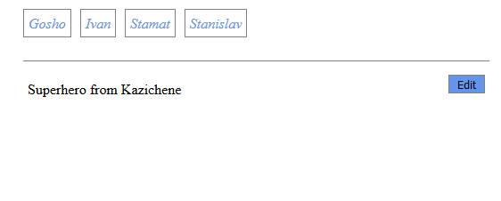
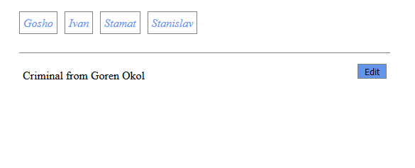
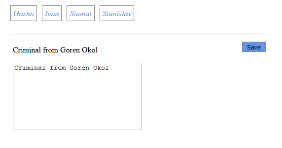
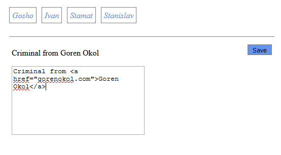
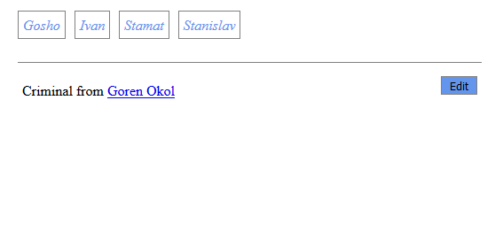

# Task 1 - Tabs

## Description
- Implement a function that accepts a **CSS selector** and an array of **tabs** as parameters and builds a tabs view with DOM structure and behaviour as described below.
    - The **CSS selector** will be a string.
    - Each **tab** has properties **title** and **content**. Both are strings.

### DOM Structure
- Inside the selected element, you need to build the following elements:
    - A `ul` with class `.tabs-nav` for the tabs navigation.
        - For each **tab**, build a `li` that contains an anchor element with class `.tab-link` and content - the **title of the tab**.
    - A `ul` with class `.tabs-content` for displaying the content of the tabs.
        - For each **tab**, build a `li` that has class `.tab-content` and contains two elements:
            - a `p` element whose content is the **content** of the tab.
            - a `button` element with class `.btn-edit` and text **Edit**.
        - The first `li` **should** have class `.visible`.

### Behaviour
- When a `.tab-link` item is clicked, the **content of the respective tab should be displayed**. Add the `.visible` class on `li.tab-content` to display contents. Remove `.visible` to hide contents.
- When a `.btn-edit` with text **Edit** is clicked, the following two things should happen:
    - The text of the clicked `.btn-edit` should be changed to **Save**.
    - A `textarea` element with class `.edit-content` should be added to the `li.tab-content`, which is the clicked buttons parent.
        - The `textarea` should have the same content as the content of the **tab**.
- When a `.btn-edit` with text **Save** is clicked, the following three things should happen:
    - The content of the displayed **tab** should be set to the value of the `textarea`.
    - The `textarea` should be **removed from the DOM**.
    - The text of the `.btn-edit` should be set back to **Edit**.

### Samples
- Assume you are given the following tabs as input parameter:

```js
[
    { title: 'Gosho', content: 'Superhero from Kazichene' },
    { title: 'Ivan', content: 'Criminal from Goren Okol' },
    { title: 'Stamat', content: 'Crime lord from Burgas' },
    { title: 'Stanislav', content: 'Travelling salesman from Busmantsi' }
]
```

- **After building the DOM structure:**



- **After clicking on _Ivan_ `.tab-link`:**



- **After clicking the _Edit_ button:**



- **Editing the content:**



- **After clicking the _Save_ button:**



## Constraints
- **DO NOT** use inline styles. You only need the classes from `main.css`.
- **DO NOT** use `innerText` or `textContent`.
- **DO NOT** use `classList` to add or remove classes.

## Hints
- You can use **custom attributes** of HTML elements to implement the tab navigation - attach the index of every tab to its `.tab-link`. Or you can use other kinds of shinenigans - JavaScript objects for example.
- If some of your zero tests fail, you can take a peek at its source.
- Take a peek at `main.css`.
- **!!! Read the description and the constraints carefully !!!**

## Running the unit tests locally
- Open the command prompt/terminal in this directory.
- Execute the command `npm install`.
- Execute the command `npm test`.

## Submission
- Your submission should be in the following format:

```js
function solve() {
    return function (selector, tabs) {
        // your solution here
    }
}
```